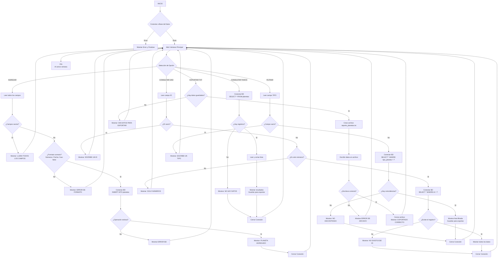

# Proyecto-Base-de-Datos-Ahora-con-interfaz-grafica
Aqui esta mi segunda versión de mi proyecto, ahora contendrá interfaz grafica y un lector de texto. Contendrá la misma base de datos de planetas 

